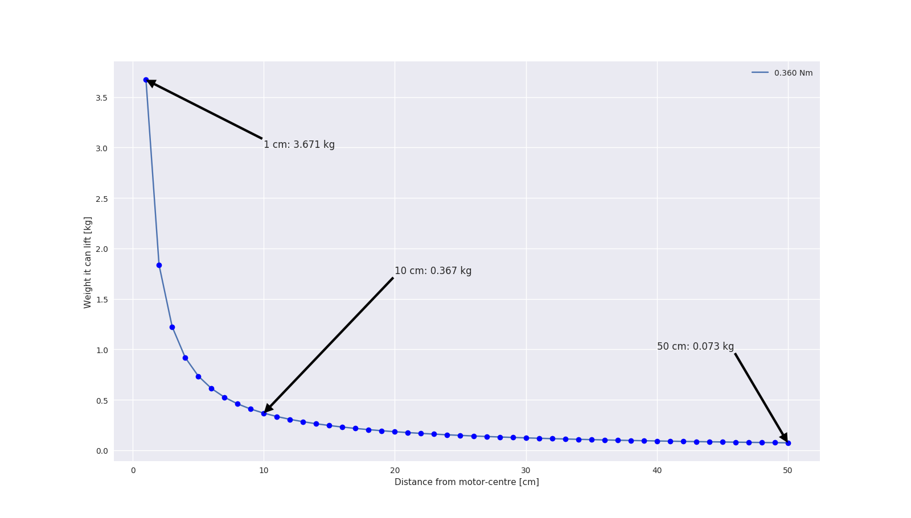
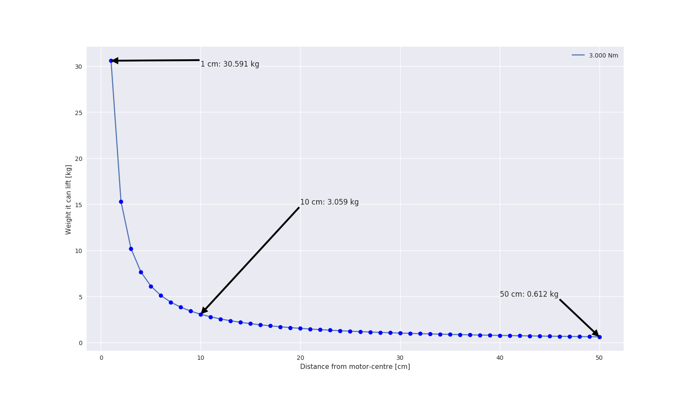

# episode_torque
Material and code of the episode about calculating torque, and tests with Nema17

## Conversion factors
Here are the conversion factors to go from Newton-meter to kg-meter or lb-inch:
* 1 kg-m = 9.80665 Nm (example: 0.36 Nm / 9.80665 = 0.03671 kg-m)
* 1 lb-inch = 0.11299 Nm (example: 0.36Nm / 0.11299 = 3.186 lb-inch)

## Torque graphs (distance vs liftable weight)
You can find the script that generated this plots here: torques.py

